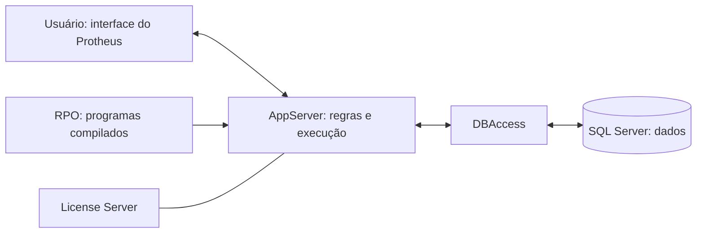

# Entendendo as peças

## O caminho de uma ação

Diagrama simplificado: a topologia e as conexões específicas dependem da configuração.

Ao salvar um equipamento, a interface recebe os dados, a rotina valida as regras, a aplicação solicita a gravação e o banco mantém o registro. O resultado retorna ao usuário.

## Docker, WSL2 e Compose

- **Imagem:** pacote usado como base para criar contêineres.
- **Contêiner:** instância da imagem; pode estar em execução ou parada.
- **Volume ou bind mount:** armazenamento separado do ciclo de vida do contêiner.
- **Compose:** descrição dos serviços, redes, portas e armazenamento que formam o ambiente.
- **WSL2:** ambiente Linux virtualizado e integrado ao Windows; neste laboratório, sustenta o backend do Docker.

Parar um contêiner não o apaga. Recriá-lo pode descartar mudanças que estavam apenas na camada gravável dele. Persistência precisa ser definida e testada.

## Desenvolvimento

| Conceito | Significado |
|---|---|
| Fonte | Texto que editamos, como um arquivo ADVPL .prw |
| Compilar | Transformar o fonte em programa utilizável pelo ambiente |
| RPO | Repositório de programas compilados |
| Debug | Acompanhar a execução e inspecionar variáveis |
| Breakpoint | Ponto em que o depurador pausa a execução |
| Ponto de entrada | Mecanismo previsto para customizar determinado momento de uma rotina padrão |

Salvar o fonte não atualiza automaticamente o programa em execução. Compilar com sucesso também não comprova que a regra de negócio esteja correta.

Ter o RPO não significa possuir todos os fontes padrão da TOTVS.

## Dados e configuração

| Nome | Papel |
|---|---|
| Tabela | Conjunto de registros |
| Campo | Informação de um registro |
| Índice | Estrutura que auxilia a localização dos registros |
| SX2 | Definições de tabelas |
| SX3 | Definições de campos |
| SIX | Definições de índices |
| SX6 | Parâmetros |
| SIGACFG | Configurador do Protheus |

Criar uma coluna diretamente no banco não equivale a configurar um campo corretamente no ERP. O dicionário e a estrutura física precisam permanecer coerentes.

Empresa, filial e compartilhamento de tabelas influenciam quais registros uma rotina deve consultar ou alterar.

## Projeto original: mapa das pastas

| Pasta ou arquivo | Responsabilidade |
|---|---|
| compose/p12.1.2310-mssql | Receita de execução com SQL Server |
| compose/p12.1.2310-PostgreSQL | Receita alternativa com PostgreSQL |
| images/protheus-base-20 | Base de construção do Protheus |
| images/protheus-dbaccess-23 | Construção do DBAccess |
| images/protheus-license | Construção do License Server |
| images/protheus-mssql-2022 | Construção do banco SQL Server |
| images/protheus-postgresql-15 | Construção do banco PostgreSQL |
| images/protheus-p12.1.2310 | Arquivos específicos da release |
| root, dentro das receitas | Árvore de arquivos copiada para dentro da imagem Linux |
| Dockerfile | Receita de construção de imagem |
| Makefile | Automação de tarefas de construção |
| bitbucket-pipelines.yml | Automação executada pelo Bitbucket |

A pipeline original baixa artefatos e possui uma etapa de construção e publicação no Docker Hub. Ela não é necessária para consumir imagens prontas e não foi copiada para este laboratório.

## Referências técnicas

- [SX3: campos das tabelas](https://tdn.totvs.com/display/framework/SX3%2B-%2BCampos%2Bdas%2Btabelas)
- [RPOs múltiplos](https://tdn.totvs.com/display/tec/RPOs%2BMultiplos)
- [Compilação com TDS-VSCode](https://github.com/totvs/tds-vscode/blob/master/docs/compilation.md)
- [Depuração com TDS-VSCode](https://github.com/totvs/tds-vscode/blob/master/docs/debugger.md)
